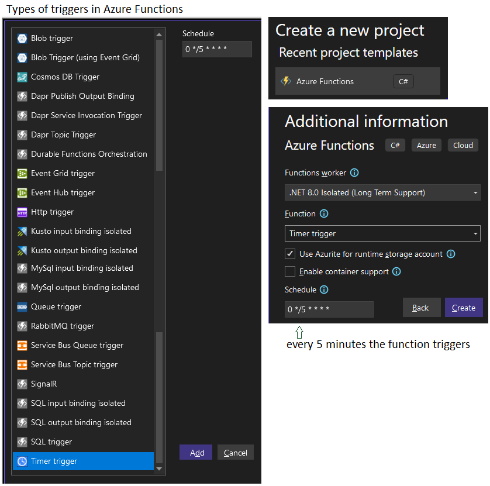
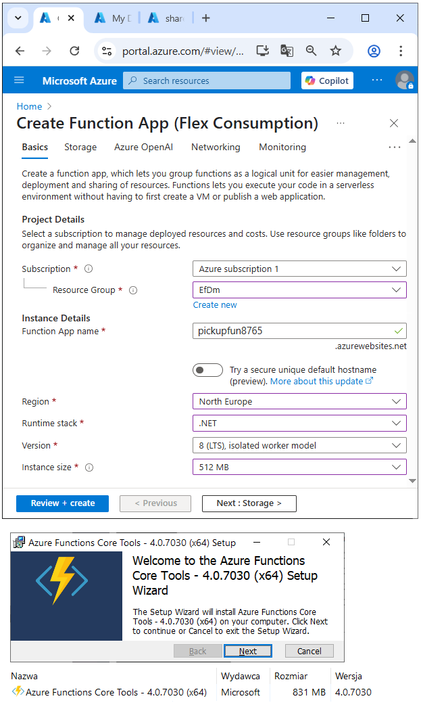
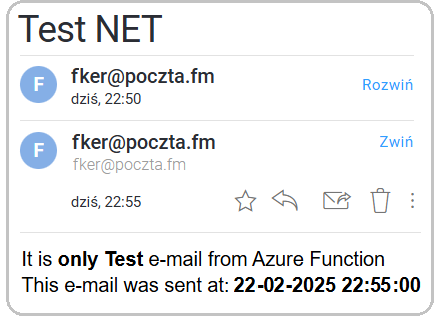

# Azure Function: Scheduled Email Sender

This project demonstrates how to send scheduled emails from an **Azure Function**. Every 5 minutes, the function sends a test HTML email using SMTP.

---

## 📘 Azure Functions – Quick Overview

### ✅ What are Azure Functions?

**Azure Functions** is a serverless compute service from Microsoft Azure.  
It lets you run small pieces of code (functions) in the cloud, without managing infrastructure.

Functions are event-driven — they are triggered by events like HTTP requests, timers, or messages in queues.

---

### ✅ Key Advantages

- **Serverless** – No server management, auto-scaling.
- **Cost-efficient** – You pay only for execution time.
- **Quick to build** – Focus on logic, not infrastructure.
- **Flexible triggers** – Respond to many types of events.
- **Easy integration** – Connect to Azure services and APIs.

---

### ✅ Common Triggers

| Trigger Type       | Description                                  | Use Case Example                        |
|--------------------|----------------------------------------------|------------------------------------------|
| `TimerTrigger`     | Runs on a schedule (like a cron job).        | Run code every 5 minutes or daily.       |
| `HttpTrigger`      | Executes on HTTP requests (GET, POST, etc).  | Create a lightweight API endpoint.       |
| `QueueTrigger`     | Reacts to new messages in Azure Storage Queue. | Background processing.               |
| `BlobTrigger`      | Fires when a file is added/updated in Blob Storage. | Process uploaded files.           |
| `ServiceBusTrigger`| Reacts to messages in Azure Service Bus.     | Enterprise message-based workflows.      |
| `EventGridTrigger` | Responds to Event Grid events.               | React to file uploads, resource changes. |

---

### ✅ Typical Uses

- Scheduled tasks (e.g., cleanup, reporting)
- Lightweight APIs
- Processing queue messages
- Real-time file processing
- Integrating with other cloud services


---
## 🔹 Creating an Azure Function

The project was written in VS2022, which has extensive tools for creating Azure Functions.




Before that, you need to create a related Azure Function in Azure:



## 🔹 Technologies used in the project
* **Azure Functions (.NET isolated worker)**
* **C#** (.NET 8+)
* **Timer Trigger**
* **SMTP with `SmtpClient`**
* **Dependency Injection**
* **Logging (ILogger)**
* **Application Insights**
* **Secrets stored in custom `SecretData` class**

---

## 🔹 Project Structure

### `Program.cs`

Configures the Azure Functions host, logging, and telemetry.

```csharp
var builder = FunctionsApplication.CreateBuilder(args);
builder.ConfigureFunctionsWebApplication();
builder.Services
    .AddApplicationInsightsTelemetryWorkerService()
    .ConfigureFunctionsApplicationInsights();
builder.Build().Run();
```

---

### `PickupFunction.cs`

The `TimerTrigger` makes it incredibly easy to have your functions executed on a 
schedule. This sample demonstrates a simple use case of calling your function 
every 5 minutes.

The function creates and uses `EmailService` to send an email.

```csharp
[Function("pickupfun8765")]
public async Task Run([TimerTrigger("0 */5 * * * *")] TimerInfo timer)
```

For a `TimerTrigger` to work, you provide a schedule in the form of a 
[cron expression]. A cron expression is a string with 6 separate expressions 
which represent a given schedule via patterns. The pattern we use to represent 
every 5 minutes is `0 */5 * * * *`. This, in plain text, means: "When seconds 
is equal to 0, minutes is divisible by 5, for any hour, day of the month, 
month, day of the week, or year".

---

### `EmailService.cs`

This class handles email sending. It loads configuration from `SecretData`, builds the email message, and sends it using `SmtpClient`.

#### Highlights:

* `InitMyMailSender()` reads credentials.
* `SendEmailTestAsync()` builds a test HTML body and subject.
* `SendEmailAsync()` uses `SmtpClient` to send the message with SSL.

---

## 🔹 `SecretData` class

SecretData stores confidential data (login and SMTP configuration) for testing in 
one place so that it does not appear in the program code. 
Ultimately, in production, the data is read from Azure KeyVault.

---

## 🔹 Schedule

The function runs **every 5 minutes** using this CRON expression:

```cron
0 */5 * * * *
```

---

## 🔹 Output

Each email contains:

* An HTML body with the current timestamp.
* A subject (default: `"Test NET"`).

Below is a viewofthe mailbox with received emails. The Azure Function 
mechanism can therefore be used to send periodic notifications to email.


